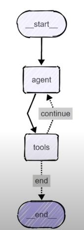
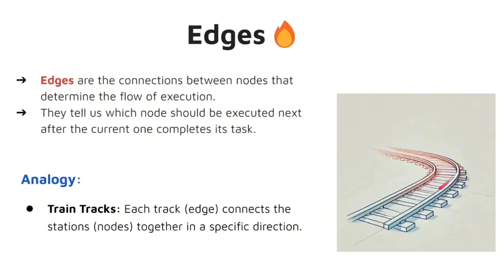

# LangGraph Lab

A comprehensive laboratory for learning LangGraph and AI Agents through hands-on exercises.

## Table of Contents

- [Basic Graph Labs](#basic-graph-labs)
- [AI Agent Labs](#ai-agent-labs)
- [Core Concepts](#core-concepts)

---

## Basic Graph Labs

### Lab 1: Hello World Graph

**Introduction to LangGraph fundamentals**

 

#### Learning Objectives

- Understand and define the *AgentState* structure
- Create simple node functions to process and update state
- Set up a basic LangGraph graph
- Compile and invoke a LangGraph graph
- Understand how data flows through a single node in LangGraph

---

### Lab 2: Multiple Input Graph

**Handling complex data structures**

#### Learning Objectives

- Define a more complex *AgentState* structure
- Create processing nodes that perform operations on list data
- Set up a LangGraph that processes and outputs computed results
- Invoke the graph with structured inputs and retrieve outputs

**Primary Focus**: Learn how to handle multiple inputs effectively

---

### Lab 3: Sequential Graph

**Connecting nodes in sequence**

#### Learning Objectives

- Create *multiple* nodes that sequentially process and update different parts of the state
- Connect nodes together in a cohesive graph structure
- Invoke the graph and observe how the state is transformed step-by-step

**Primary Focus**: Create and manage multiple interconnected nodes

---

### Lab 4: Conditional Graph

**Implementing decision-making logic**

#### Learning Objectives

- Implement *conditional* logic to route data flow to different nodes
- Use *START* and *END* nodes to manage entry and exit points explicitly
- Design multiple nodes to perform different operations (addition, subtraction)
- Create a *router node* to handle decision-making and control graph flow

**Primary Focus**: Master the use of *add_conditional_edges()*

---

### Lab 5: Looping Graph

**Creating iterative processing flows**

#### Learning Objectives

- Implement *looping logic* to route data flow back to nodes
- Create a single *conditional edge* to handle decision-making and control graph flow
- Build robust iterative processing systems

**Primary Focus**: Implement and manage looping logic

---

## AI Agent Labs

### Lab 6: Simple Bot (AI Agent 1)

**Building your first AI-powered agent**

#### Learning Objectives

- Define state structure with a list of *HumanMessage* objects
- Initialize a GPT-4o model using LangChain's *ChatOpenAI*
- Send and handle different types of messages
- Build and compile the agent's graph structure

---

### Lab 7: Chatbot (AI Agent 2)

**Creating conversational AI with memory**

#### Learning Objectives

- Work with different message types: *HumanMessage* and *AIMessage*
- Maintain full conversation history using both message types
- Utilize GPT-4o model through LangChain's *ChatOpenAI*
- Create a sophisticated conversation loop with context retention

**Primary Focus**: Implement memory capabilities for your AI agent

---

### Lab 8: ReAct Agent (AI Agent 3)

**Reasoning and Acting Agent**

#### Learning Objectives

- Learn how to create and integrate *Tools* in LangGraph
- Build a comprehensive *ReAct Graph* architecture
- Work with different message types, including *ToolMessages*
- Test and validate the robustness of your graph implementation

**Primary Focus**: Create a robust ReAct (Reasoning and Acting) Agent

---

### Lab 9: Document Drafting System (AI Agent 4)

**Solving real-world business problems**

#### Challenge Description

Our company is experiencing efficiency issues! We spend excessive time drafting documents, and this needs immediate attention!

#### Task Requirements

Create an AI Agentic System that can:
- Accelerate document and email drafting processes
- Provide continuous feedback and iterative improvements
- Stop processing when the human user is satisfied with the draft
- Operate efficiently and save drafts automatically

**Primary Focus**: Build a production-ready document assistance system

---

### Lab 10: RAG System (AI Agent 5)

**Retrieval-Augmented Generation**

#### Learning Objectives

- Implement Retrieval-Augmented Generation (RAG) architecture
- Integrate external knowledge sources with AI agents
- Build sophisticated information retrieval and generation systems

**Primary Focus**: Create intelligent systems that can access and utilize external knowledge

---

## Core Concepts

### LangGraph Fundamental Elements

---

## Additional Resources

This laboratory is based on the comprehensive tutorial available at: [LangGraph Tutorial Video](https://www.youtube.com/watch?v=jGg_1h0qzaM)